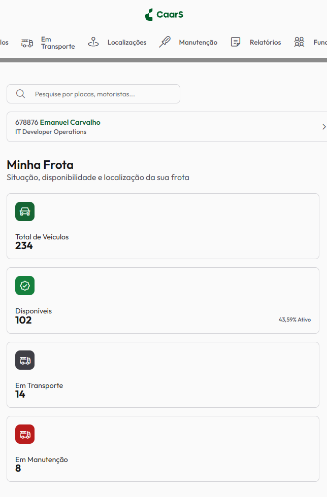
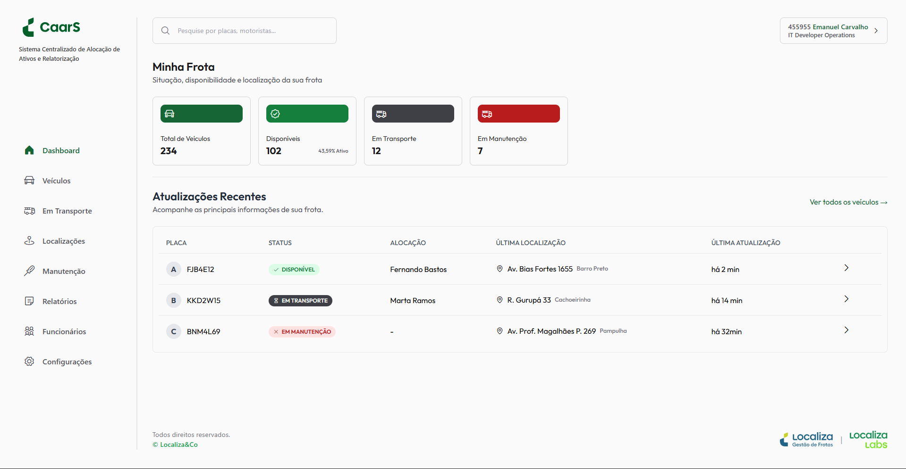

# Dados Básicos
- Nome: **Emanuel Phillipe Ribeiro Ferreira de Carvalho**
- Número de Matrícula: **879572**
- Proposta de Projeto Escolhida: **Organizações e Equipes**

## Breve Descrição Sobre o Projeto
Localiza CaarS **(Sistema Centralizado de Alocação de Ativos e Relatorização)** define-se como um sistema no qual unifica a alocação de veículos a funcionários, visualização de movimentações e situações, criação de relatórios, manejo de funcionários, abertura de pedidos de manutenibilidade veicular e acompanhamento e controle em tempo real de um carro..
Baseado em algumas telas de seu legado, SPOC, CaarS unifica tarefas que, antes, era necessário a abertura de numerosas interfaces para as suas execuções.

Resultado final da interface MOBILE:

Resultado final da interface DESKTOP:

